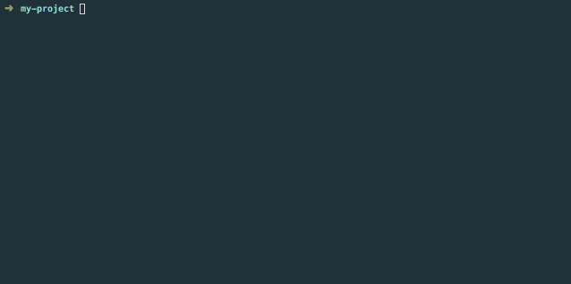

# nsm

> The copy-paste version of the npm CLI

**`nsm`** (npm snippet manager) is a thingy that lets you copy any JavaScript file from any package (that specifies a GitHub repository) published to npm, directly from the command line.



## Installation

```sh
npm install -g nsm-cli
```

## Commands

### `copy`

Copies a file from a package's repo and writes it to a given destination. Omitted arguments are queried using prompts.

If the `--save` option is specified (at the end), A reference will be stored in a `snippets` collection in package.json.

```sh
nsm copy [package] [source] [destination] [--save]
```

### `summon`

Downloads all files listed in the `snippets` collection in package.json and writes them to their defined destinations.

```sh
nsm summon
```